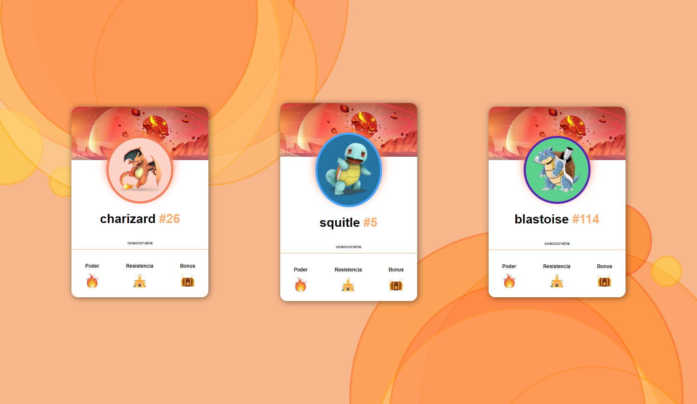

# Cards Pokemon

This project is about collectible pokemon cards

# Screen Project



# Install

```sh
git clone https://github.com/asalinasf/cards-pokemon/
cd cards-pokemon
open in your browse
```

# HTML
```html
<!DOCTYPE html>
<html lang="en">

<head>
    <meta charset="UTF-8">
    <meta http-equiv="X-UA-Compatible" content="IE=edge">
    <meta name="viewport" content="width=device-width, initial-scale=1.0">
    <title>Card Pokemon</title>
    <link rel="stylesheet" href="css\styles.css">
    <link rel="shortcut icon" href="img\charizard.png" type="image/x-icon">
</head>

<body>
    <main class="container">
        <article class="card">
            
            <div class="card-body">
                <div class="card-body-contentimg">
                    
                </div>
                <h1 class="card-body-title">
                    Charizard
                    <span>
                        #26
                    </span>
                </h1>
                <p class="card-body-text">Collectable</p>
            </div>
            <div class="card-footer">
                <div class="card-footer-poder">
                    <h3>Power</h3>
                    
                </div>
                <div class="card-footer-poder">
                    <h3>Endurance</h3>
                    
                </div>
                <div class="card-footer-poder">
                    <h3>Bonus</h3>
                    
                </div>
            </div>
        </article>
        <article class="card">
            
            <div class="card-body">
                <div class="card-body-contentimg2">
                    
                </div>
                <h1 class="card-body-title">
                    Squirtle
                    <span>
                        #5
                    </span>
                </h1>
                <p class="card-body-text">Collectable</p>
            </div>
            <div class="card-footer">
                <div class="card-footer-poder">
                    <h3>Power</h3>
                    
                </div>
                <div class="card-footer-poder">
                    <h3>Endurance</h3>
                    
                </div>
                <div class="card-footer-poder">
                    <h3>Bonus</h3>
                    
                </div>
            </div>
        </article>
        <article class="card">
            
            <div class="card-body">
                <div class="card-body-contentimg3">
                    
                </div>
                <h1 class="card-body-title">
                    Blastoise
                    <span>
                        #114
                    </span>
                </h1>
                <p class="card-body-text">Collectable</p>
            </div>
            <div class="card-footer">
                <div class="card-footer-poder">
                    <h3>Power</h3>
                    
                </div>
                <div class="card-footer-poder">
                    <h3>Endurance</h3>
                    
                </div>
                <div class="card-footer-poder">
                    <h3>Bonus</h3>
                    
                </div>
            </div>
        </article>
    </main>
</body>

</html>
```

# CSS
```css
:root {
  --color1:#F8B78B;
  --color2: #FCB173;
}

html {
  box-sizing: border-box;
  font-size: 62.5%;
}

*, *:before, *:after {
  box-sizing: inherit;
}

body {
  margin: 0;
  padding: 0;
  font-family: sans-serif, Arial, Helvetica;
  background-color: var(--color1);
  background-image: url(../img/fondoTop.svg), url(../img/fondoBotton.svg);
  background-repeat: no-repeat, no-repeat;
  background-position: right 50vw bottom 50vh, left 50vw top 50vh;
}

.container {
  display: flex;
  justify-content: space-evenly;
  align-items: center;
  height: 100vh;
}

.card {
  background-color: white;
  width: 328px;
  border-radius: 16px;
  box-shadow: 2px 2px 15px rgba(0, 0, 0, 0.5);
  overflow: hidden;
}
.card-header {
  display: block;
  width: 100%;
}
.card-body {
  display: flex;
  flex-direction: column;
  align-items: center;
  border-bottom: 1px solid var(--color2);
}
.card-body-contentimg {
  border: 5px solid #f67c55;
  border-radius: 50%;
  background-color: #FCD3c6;
  box-shadow: 0px -10px 20px #f67c55;
  margin-top: -58px;
}
.card-body-contentimg-img {
  padding: 20px;
}
.card-body-contentimg2 {
  border: 5px solid rgb(73, 167, 255);
  border-radius: 50%;
  background-color: rgb(36, 115, 160);
  box-shadow: 0px -10px 20px #f67c55;
  margin-top: -58px;
}
.card-body-contentimg2-img {
  padding: 20px;
}
.card-body-contentimg3 {
  border: 5px solid #5b25b3;
  border-radius: 50%;
  background-color: #5cd18d;
  box-shadow: 0px -10px 20px #f67c55;
  margin-top: -58px;
}
.card-body-contentimg3-img {
  padding: 20px;
}
.card-body-title {
  margin-top: 2rem;
  font-size: 3rem;
}
.card-body-title span {
  color: var(--color2);
}
.card-footer {
  display: flex;
  justify-content: space-around;
}
.card-footer-poder {
  text-align: center;
  margin-bottom: 2rem;
  margin-top: 2rem;
}

@media (max-width: 600px) {
  .container {
    flex-direction: column;
    height: 190vh;
  }
}

```
# Visit my project with this url

https://cartasaaronsalinas.netlify.app/
